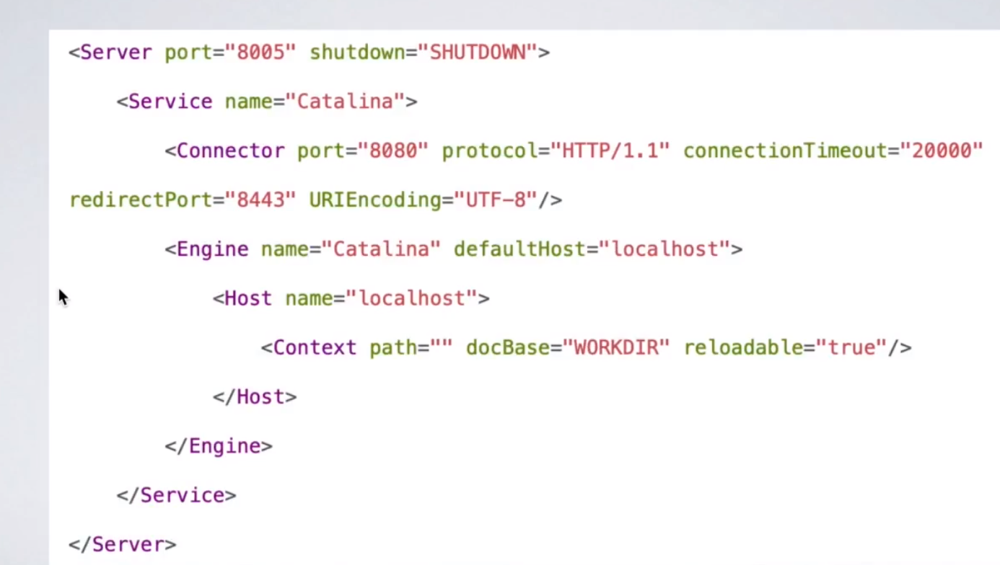

## 一、基于 HTTP 协议的实现
### 服务端实现（com.shadow.simulation.framework.http.server.*）
   
```java
        Tomcat tomcat = new Tomcat();

		Server server = tomcat.getServer();
		Service service = server.findService("Tomcat");

		Connector connector = new Connector();
		connector.setPort(url.getPort());

		Engine engine = new StandardEngine();
		engine.setDefaultHost(url.getHostname());

		Host host = new StandardHost();
		host.setName(url.getHostname());

		String contextPath = "";
		Context context = new StandardContext();
		context.setPath(contextPath);
		context.addLifecycleListener(new Tomcat.FixContextListener());

		host.addChild(context);
		engine.addChild(host);

		service.setContainer(engine);
		service.addConnector(connector);

		tomcat.addServlet(contextPath,"dispatcher",new DispatcherServlet());
		context.addServletMappingDecoded("/*","dispatcher");

		try {
			tomcat.start();
			tomcat.getServer().await();
		} catch (LifecycleException e) {
			e.printStackTrace();
		}
```

### 客户端实现
```java
        // 网络传输
		try {
			URL url = new URL("http", innerUrl.getHostname(), innerUrl.getPort(), "/");
			HttpURLConnection connection = (HttpURLConnection) url.openConnection();

			connection.setRequestMethod("POST");
			connection.setDoOutput(true);

			// 发送数据
			OutputStream outputStream = connection.getOutputStream();
			ObjectOutputStream oos = new ObjectOutputStream(outputStream);
			oos.writeObject(invocation);
			oos.flush();
			oos.close();

			// 接收返回的数据并返回
			InputStream inputStream = connection.getInputStream();
			String result = IOUtils.toString(inputStream,"utf-8");
			return result;
		} catch (Exception e) {
			e.printStackTrace();
		}
		return null;
```


## 二、基于 Dubbo（Netty）协议的实现
### 服务端实现（com.shadow.simulation.framework.dubbo.server.*）
   netty的基本使用
```java
		NioEventLoopGroup bossGroup = new NioEventLoopGroup(1);
		NioEventLoopGroup workGroup = new NioEventLoopGroup(Runtime.getRuntime().availableProcessors());

		ServerBootstrap serverBootstrap = new ServerBootstrap();
		serverBootstrap.group(bossGroup,workGroup)
				.channel(NioServerSocketChannel.class)
				.childHandler(new ChannelInitializer<SocketChannel>() {
					@Override
					protected void initChannel(SocketChannel ch) throws Exception {
						ChannelPipeline pipeline = ch.pipeline();
						pipeline.addLast(new StringEncoder())
								.addLast(new StringDecoder())
								.addLast(new DubboServerHandler());
					}
				});

		try {
			ChannelFuture channelFuture = serverBootstrap.bind(hostname, port).sync();
			System.out.println("nettyCore server started on hostname " + hostname + " and port on " + port);
			channelFuture.channel().closeFuture().sync();
		} catch (InterruptedException e) {
			e.printStackTrace();
		}finally {
			bossGroup.shutdownGracefully();
			workGroup.shutdownGracefully();
		}
```

### 客户端实现
```java
	// 线程池
	private static ExecutorService executorService = Executors.newFixedThreadPool(Runtime.getRuntime().availableProcessors());
	// 任务-也是业务处理类
	private DubboClientHandler dubboClientHandler;
	// 执行的调用方法
	public Object send(URL url, Invocation invocation) {
		// init
		if(dubboClientHandler == null){
			initDubbo(url.getHostname(),url.getPort());
		}
		// 请求参数设置
		dubboClientHandler.setInvocation(invocation);
		try {
			// 线程池同步执行获取结果
			return executorService.submit(dubboClientHandler).get();
		} catch (InterruptedException e) {
			e.printStackTrace();
		} catch (ExecutionException e) {
			e.printStackTrace();
		}
		return null;
	}


	private void initDubbo(String hostname,int port) {

		dubboClientHandler = new DubboClientHandler();

		NioEventLoopGroup group = new NioEventLoopGroup();
		Bootstrap bootstrap = new Bootstrap();
		bootstrap.group(group)
				.option(ChannelOption.TCP_NODELAY,true)
				.channel(NioSocketChannel.class)
				.handler(new ChannelInitializer<SocketChannel>() {
					@Override
					protected void initChannel(SocketChannel ch) throws Exception {
						ChannelPipeline pipeline = ch.pipeline();
						pipeline.addLast(new StringEncoder())
								.addLast(new StringDecoder())
								.addLast(dubboClientHandler);
					}
				});
		try {
			bootstrap.connect(hostname,port).sync();
			System.out.println("connect to hostname " + hostname + " port " + port);
		} catch (InterruptedException e) {
			e.printStackTrace();
		}

	}

```

## Dubbo 原理
### 一、Dubbo架构角色
   
   
   
   
   节点	        角色说明
   Provider	    暴露服务的服务提供方
   Registry	    服务的注册与发现的注册中心，如zookeper(推荐)、multicast、redis、simple
   Consumer	    调用远程服务的服务消费方
   Monitor	    统计服务的调用次数和调用时间的监控中心
   Container    服务运行容器
   
   调用流程:
   
    1.服务器负责启动，加载，运行服务提供者。
    2.服务提供者在启动时，向注册中心注册自己所提供的服务
    3.服务消费者在启动时，向注册中心订阅自己所需的服务
    4.注册中心返回服务提供者地址列表给消费者，如果有变更，注册中心将基于TCP长连接推送变更数据给消费者
    5.服务消费者从提供的服务列表中，基于软负载均衡算法，选一台提供者进行调用，如果失败，则选择另一台调用
    6.服务消费者和提供者，在内存中累计调用次数和调用时间，定时每分钟发送一次统计数据到检测中心

### 二、源码关键类
    
    1、DubboNamespaceHandler
       ① ApplicationConfig
       ② ModuleConfig
       ③ RegistryConfig
       ④ MonitorConfig
       ⑤ ProviderConfig
       ⑥ ConsumerConfig
       ⑦ ProtocolConfig
       ⑧ ServiceBean -> dubbo:service
       ⑨ ReferenceBean -> dubbo:reference
       ⑩ AnnotationBean
       
    2、BeanDefinitionParser -> DubboBeanDefinitionParser
       Protocol -> DubboProtocol、RegistryProtocol
      解析 XML 文件
      
    3、ServiceBean -> InitializingBean（afterPropertiesSet()）、ApplicationListener（onApplicationEvent(ContextRefreshedEvent)）
      ① afterPropertiesSet()
      ② onApplicationEvent(ContextRefreshedEvent) -> export() 暴露服务
        
    4、ReferenceBean -> FactoryBean（getObject()）
      ① getObject() -> 获取代理对象